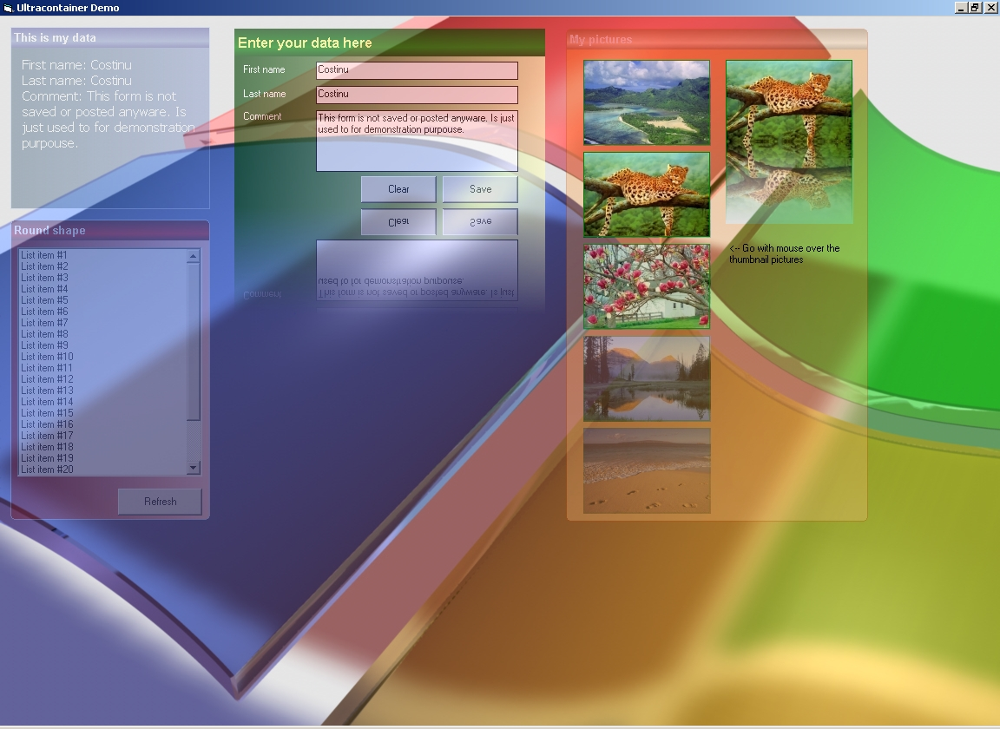



## Ultracontainer \(beta version\)

### Description

Hi,

I have created an ActiveX control which is a control container like a picturebox with extra fetures. This control can fade in/out depending of distance between mouse pointer and control, can draw bottom mirror, it haves title gradient and transparency. This control can be used to create nice user interfaces.

Costinu
 
### More Info
 

             |
---                |---
**Submitted On**   |2009-10-09 11:40:50
**By**             |[Costinu](https://github.com/Planet-Source-Code/PSCIndex/blob/master/ByAuthor/costinu.md)
**Level**          |Intermediate
**User Rating**    |4.9 (39 globes from 8 users)
**Compatibility**  |VB 6\.0
**Category**       |[Custom Controls/ Forms/  Menus](https://github.com/Planet-Source-Code/PSCIndex/blob/master/ByCategory/custom-controls-forms-menus__1-4.md)
**World**          |[Visual Basic](https://github.com/Planet-Source-Code/PSCIndex/blob/master/ByWorld/visual-basic.md)
**Archive File**   |[Ultraconta21647710102009\.zip](https://github.com/Planet-Source-Code/costinu-ultracontainer-beta-version__1-72539/archive/master.zip)

